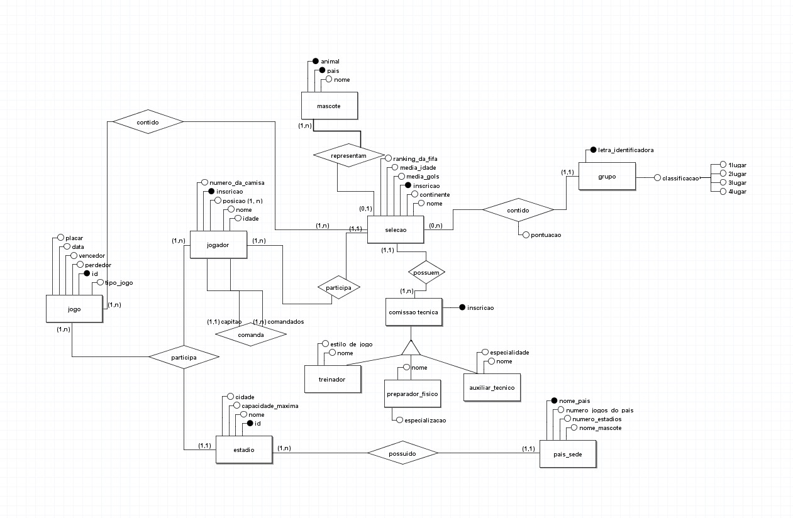
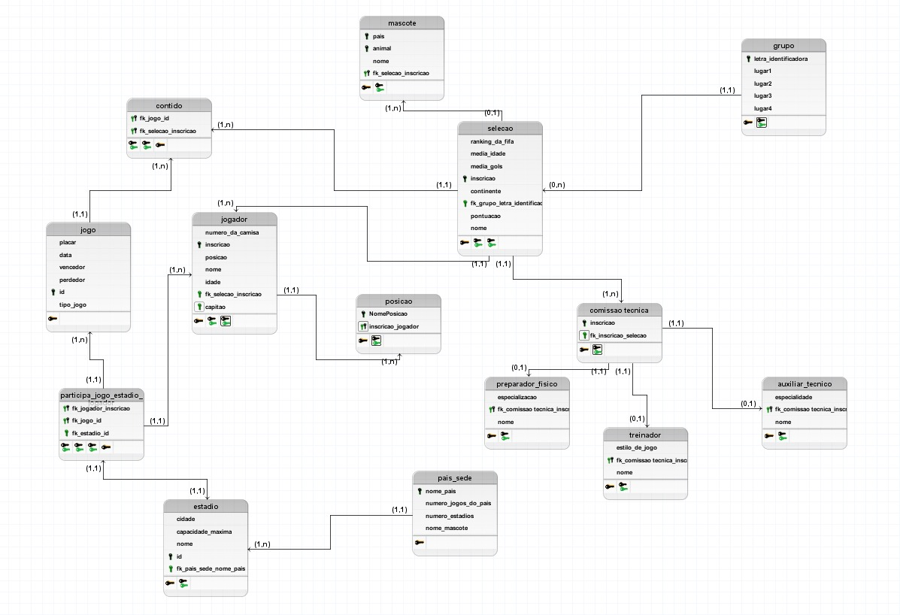

# World Data Cup

## Descrição Minimundo

O mini mundo tem como tema principal a copa do mundo de clubes que acontecerá no ano de 2026. As principais entidades são seleção, jogo, jogador e país sede

## Entidades e Relacionamentos

* Seleção - Grupo (1:N): Uma seleção pertence a um único grupo, mas um grupo possui várias seleções.

* Seleção - Jogador (1:N): Uma seleção possui muitos jogadores.

* País Sede - Estádio (1:N): Um país pode ter vários estádios sediando jogos.

* Jogo - Seleção (N:N): Um jogo envolve duas seleções (mapeado via tabela contido).

* Comissão Técnica (Herança): A comissao_tecnica é uma entidade genérica que se especializa em treinador, preparador_fisico ou auxiliar_tecnico.

* Mascote é entidade fraca

* Jogador tem o auto-relacionamento comanda

## Tecnologias utilizadas

* Linguagem: Java 
* Bnaco de dados: MySQL

## Query's

* Adição(Insert)
* Atualização(Update)
* Remoção(Delete)
